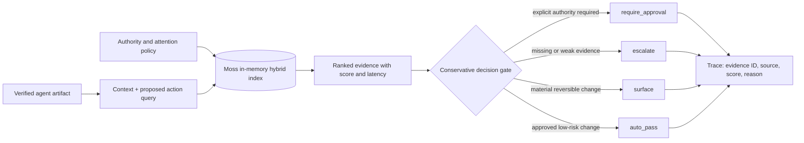

# Architecture

Moss is the retrieval layer, not a decorative dependency. Policy documents are indexed with decision metadata, loaded in memory, and queried with hybrid semantic/keyword search. The gate enforces safe precedence after retrieval and fails closed below the score threshold.
